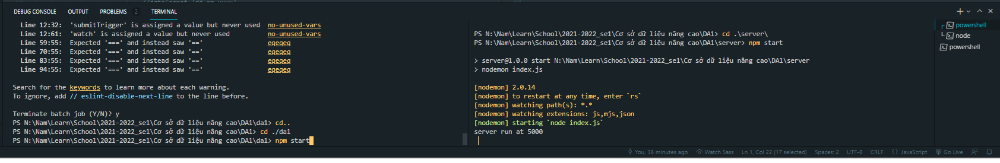

- Tải vsc, tải nodejs bản recomended for most users, tải git
- Link git: https://git-scm.com/downloads
- Link nodejs: https://nodejs.org/en/ (tải bên trái) 
- Link VSCode: https://code.visualstudio.com/ check = lệnh git --version, nếu ko ra gì thì restart máy
- B1: tạo thư mục chứa source code
- B2: mở VSC -> file -> open folder... -> chọn folder vừa tạo
- B3: nhấn ctrl + ~ (để mở terminal, gõ ở terminal) 'gõ git init' tiếp theo 'git pull https://github.com/Boom-Chill/TEST-TwelveIS-CSDLNC1-DA1.git'
- B3.5: Mở thêm 1 terminal để truy cập vào thư mục 1 da1, 1 server
- B4: truy cập vào từng thư mục vừa pull về bằng lệnh 'cd ./da1' và 'cd ./server' (mở 2 terminal để chạy, 2 cái này là 2 lệnh riêng)
- B5: ở mỗi terminal chạy lệnh 'npm install' để kéo package về (ko chạy đc npm có thể là do chưa tải, cài đc nodejs)
- B6: sau khi đã kéo về thành công ở mỗi terminal chạy lệnh npm start để bắt đầu

Note: 
- nếu không chạy đc server thì xem thử tên database đúng chưa (server/index.js dòng 8~15 (như hình là 'DA1'), keywword: config MSSQL by window authentication in nodejs 
/ use mssql/msnodesqlv8, khác với xác thực bằng tài khoản mật khẩu, dùng xác thực bằng window vậy cho tiện)

config trên máy tính 
- B1: bấm window + R copy đọn này 'compmgmt.msc' vào và nhấn OK
- 
- B2: mở bản computer management mở ô có màu xám (SQL Server Services)
- 
- B3: double click vào SQL Server Browser qua tab service chỉnh start mode về automatic, sau đó cho khởi chạy như h
- 
- B3.5: Sau đó cho khởi chạy như hình (nhấn start)
- 
- B4: Chọn Protocol for MSSQLSERVER (tên MSSQLSERVER có thể thay đổi dựa vào tên server mssql), double click vào TCP/IP 
- 
- B5: Chọn IP Addresses của bản TCP/IP cấu hình lại như hình  
- 
- B6: Restart lại 2 server trong hình
- 
